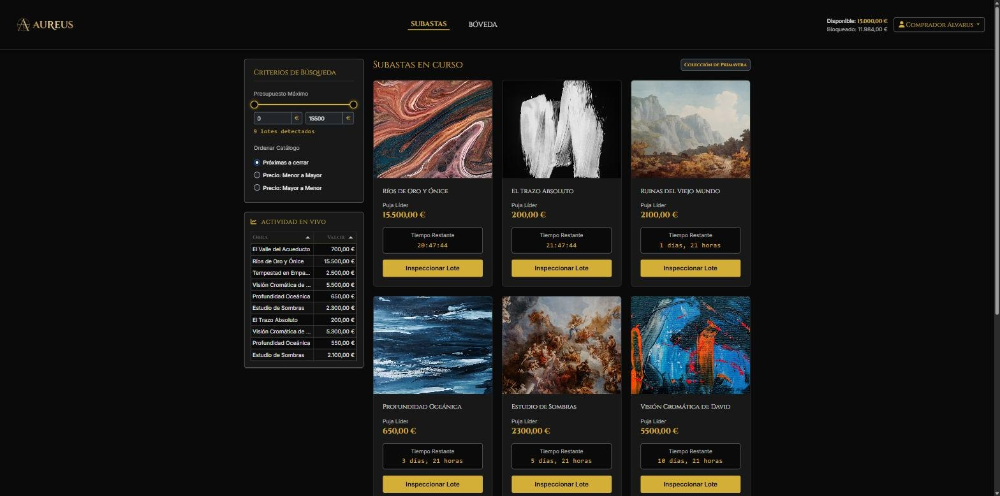
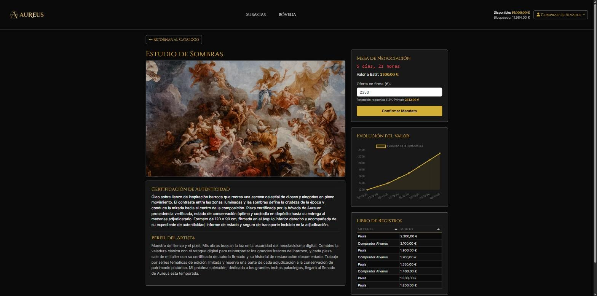
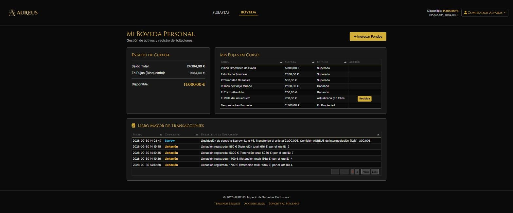
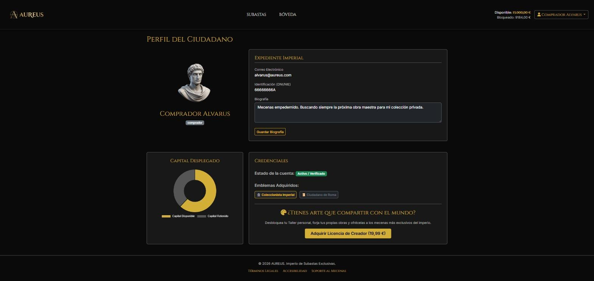
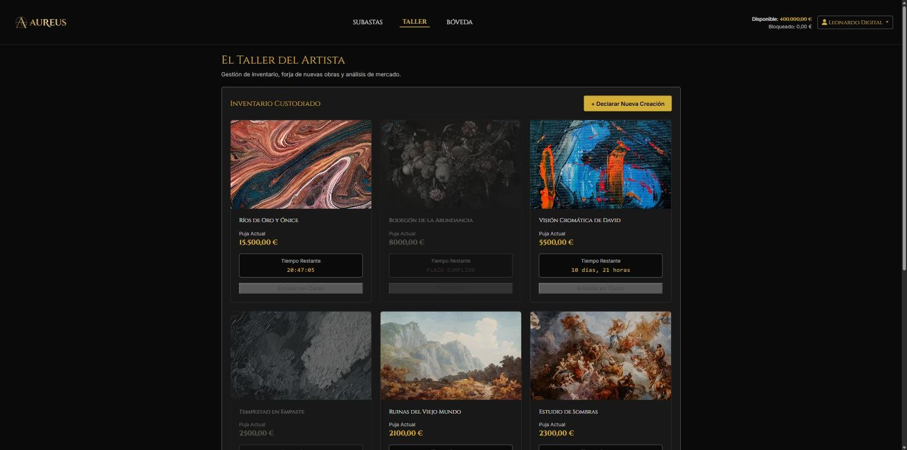
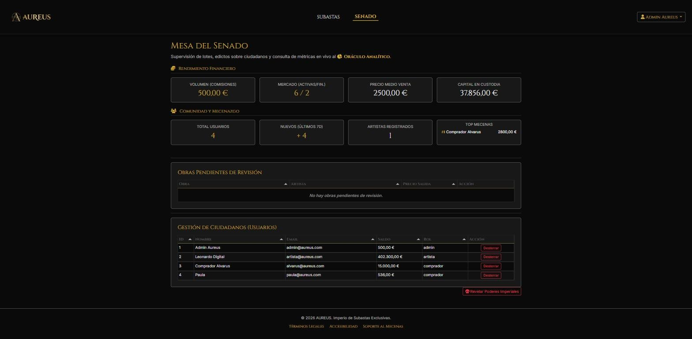

# AUREUS · Plataforma de subastas de arte

<p>
  
  
  
  
  
</p>

Mercado de subastas de arte en tiempo real donde **artistas** publican obras, **mecenas** pujan por ellas y la plataforma custodia el dinero hasta que la obra llega a su comprador. Proyecto intermodular de 2.º de DAW, hecho en equipo de dos.

Lo interesante no es solo la estética: resuelve problemas reales de una plataforma que mueve dinero. **Dos personas pujando a la vez por la misma obra, saldos que no pueden descuadrarse, pujas de último segundo y archivos subidos por usuarios** que podrían ser maliciosos.

<p align="center">
  
</p>

> La interfaz usa una temática romana: **Bóveda** es la cuenta del usuario, **Taller** el espacio del artista y **Senado** el panel de administración.

## Índice

1. [Mi parte en el proyecto](#mi-parte-en-el-proyecto)
2. [Recorrido por la aplicación](#recorrido-por-la-aplicación)
   1. [Catálogo y actividad en vivo](#1-catálogo-y-actividad-en-vivo)
   2. [Ficha de obra y sistema de pujas](#2-ficha-de-obra-y-sistema-de-pujas)
   3. [Bóveda: saldo, pujas y liquidación](#3-bóveda-saldo-pujas-y-liquidación)
   4. [Perfil del usuario](#4-perfil-del-usuario)
   5. [Taller del artista](#5-taller-del-artista)
   6. [Senado: panel de administración](#6-senado-panel-de-administración)
3. [Ciclo de vida de una obra](#ciclo-de-vida-de-una-obra)
4. [Arquitectura](#arquitectura)
5. [Seguridad](#seguridad)
6. [Ejecutarlo en local](#ejecutarlo-en-local)

## Mi parte en el proyecto

| Área | Responsable |
|---|---|
| **Frontend completo (SPA):** navegación sin recargas, estado global, módulos ES6, gráficas, tablas, temporizadores y filtros | **Álvaro de Vicente** |
| **UX/UI:** diseño de toda la interfaz y de la experiencia de uso | **Álvaro de Vicente** |
| **Integración de pagos** con el SDK de PayPal (entorno sandbox) | **Álvaro de Vicente** |
| Backend, modelo de datos, roles (RBAC) y transacciones en MySQL | Compañero de equipo |

## Recorrido por la aplicación

### 1. Catálogo y actividad en vivo

La portada muestra las subastas en curso con su puja líder y una cuenta atrás.

- **Filtros instantáneos:** el control de presupuesto (noUiSlider) y la ordenación por cierre o por precio filtran y ordenan en el navegador el catálogo ya descargado, sin volver a pedirlo al servidor.
- **Cuenta atrás en cada tarjeta** (EasyTimer.js): muestra días y horas cuando queda mucho, y horas, minutos y segundos en el último día.
- **Actividad en vivo:** una tabla (Tabulator) con las últimas pujas de toda la plataforma, que se refresca cada 10 segundos.

**Problema: el polling satura la base de datos.** Con muchos usuarios consultando la actividad cada 10 segundos, MySQL recibiría una consulta por usuario y ciclo. **Solución:** el servidor guarda la respuesta en un **archivo de caché** y solo vuelve a consultar la base de datos cuando alguien puja, porque cada puja nueva invalida esa caché.

**Problema: cerrar las subastas a su hora sin un cron.** **Solución:** al cargar el catálogo se ejecuta `liquidar_vencidas`. Las obras cuyo plazo ha terminado pasan a **FINALIZADA** con su ganador asignado, o a **DESIERTA** si nadie pujó.

### 2. Ficha de obra y sistema de pujas

<p align="center">
  
</p>

La ficha reúne la obra, su certificado de autenticidad, el perfil del artista y tres paneles:

- **Mesa de negociación:** cuenta atrás, precio a batir y el importe exacto que se retendrá antes de confirmar la puja.
- **Evolución del valor:** gráfica con Chart.js de todas las pujas en el tiempo.
- **Libro de registros:** cada puja con su mecenas y su importe.

**Reglas de negocio**

- La primera puja debe igualar o superar el precio de salida; las siguientes, superar la actual en **al menos 50 €**.
- Al pujar se **retiene el importe más un 12 % de prima de comprador**. Ese dinero pasa de «disponible» a «bloqueado» y no se puede usar en otra subasta.
- Cuando alguien te supera, **tu retención se libera automáticamente** en esa misma operación.
- **Antisniping:** si alguien puja en los últimos 5 minutos, el cierre se amplía hasta 5 minutos después de esa puja. Nadie puede ganar pujando en el último segundo.

**Problema: dos personas pujan a la vez por la misma obra.** Sin control, ambas podrían leer el mismo precio y quedar las dos como ganadoras, o descuadrarse los saldos. **Solución:** toda la puja es **una única transacción ACID**. Dentro de ella se bloquean con `SELECT ... FOR UPDATE` el saldo del postor, la fila de la obra y la puja líder. Si otra persona puja en el mismo instante, su transacción espera a que termine la primera y después se valida contra el precio ya actualizado. Si cualquier comprobación falla (saldo insuficiente, incremento pequeño, subasta cerrada), se hace `rollback` y no cambia nada. Cada puja queda además registrada en un log de auditoría con la IP de origen.

### 3. Bóveda: saldo, pujas y liquidación

<p align="center">
  
</p>

- **Estado de cuenta:** saldo total, bloqueado en pujas y disponible.
- **Mis pujas:** cada obra con su estado (*Ganando*, *Superado*, *Adjudicada (en tránsito)*, *En propiedad*), calculado directamente en la consulta SQL con un `CASE`.
- **Libro mayor:** todas las operaciones del usuario (pujas, ingresos, liquidaciones) con fecha y detalle.
- **Ingresar fondos** con PayPal (entorno de pruebas).

**Problema: el comprador paga, pero ¿y si la obra no llega?** **Solución: custodia (escrow).** Cuando termina la subasta, el dinero del ganador sigue bloqueado: ni el artista ni la plataforma lo reciben todavía. Solo cuando el comprador pulsa **«Recibida»** se liquida, de nuevo en una única transacción:

| Parte | Movimiento |
|---|---|
| Comprador | Se descuenta la retención: precio final + 12 % |
| Artista | Recibe el 92 % del precio final |
| Plataforma | Recibe el 20 %: el 12 % de prima del comprador más el 8 % de comisión al artista |

Cada liquidación genera **dos asientos en el libro mayor** (partida doble): la salida en la cuenta del comprador y el ingreso en la del artista.

**Problema: que alguien falsee un pago desde el navegador.** **Solución:** el botón de PayPal crea la orden en el navegador, pero el saldo no se suma ahí. El backend pide un token OAuth2 a PayPal y **comprueba el pago servidor a servidor** antes de acreditar nada.

### 4. Perfil del usuario

<p align="center">
  
</p>

Datos de la cuenta, biografía editable, gráfica de capital disponible frente a retenido e insignias. Desde aquí un comprador puede **comprar la licencia de creador (19,99 €)** para convertirse en artista. El cobro y el cambio de rol se hacen en la misma transacción: nunca queda un rol cambiado sin cobrar ni un cobro sin el rol.

### 5. Taller del artista

<p align="center">
  
</p>

El artista ve su inventario con el estado de cada obra y el precio alcanzado, y puede **declarar una nueva creación**: título, descripción, precio de salida, fecha de cierre e imagen.

**Problema: una subida de archivos es la puerta clásica para ejecutar código en el servidor.** **Solución:**

- No se confía en la extensión: el **tipo real se detecta con `finfo`** leyendo el contenido del archivo, y solo se aceptan JPG, PNG y WEBP.
- Límite de **20 MB** por archivo.
- El archivo se guarda con un **nombre aleatorio** (`uniqid`) y la extensión de su tipo real, nunca con el nombre que envió el usuario.

La obra nueva queda **PENDIENTE** y no aparece en el catálogo hasta que un administrador la aprueba.

### 6. Senado: panel de administración

<p align="center">
  
</p>

- **Métricas:** volumen de comisiones, subastas activas y finalizadas, precio medio de venta, capital en custodia, usuarios, altas de la última semana, artistas y ranking de mecenas.
- **Moderación:** las obras pendientes se aprueban (pasan a ACTIVA) o se rechazan.
- **Gestión de usuarios:** cambio de rol, **destierro** (borrado lógico: la cuenta se desactiva sin perder su historial financiero) y **amnistía** para reactivarla.
- **Herramientas de soporte:** inyectar saldo, cambiar la fecha de cierre de una subasta y eliminar obras.

**Problema: las consultas analíticas son pesadas y no deben frenar las pujas.** **Solución:** las métricas las calcula un **microservicio aparte en Python (FastAPI + SQLAlchemy)** que lee la misma base de datos y devuelve un JSON por dominios (económico y usuarios). La API de pujas no carga con ese trabajo.

**Problema: ocultar un botón no protege nada.** **Solución:** cada operación de administración comprueba en el servidor que la sesión tiene rol `admin` (RBAC).

## Ciclo de vida de una obra

```
PENDIENTE ──(admin aprueba)──▶ ACTIVA ──(vence el plazo)──▶ FINALIZADA ──(comprador confirma)──▶ ENTREGADA
    │                            │                          dinero en custodia                dinero liquidado
    └──(admin rechaza)──▶ RECHAZADA └──(nadie pujó)──▶ DESIERTA
```

## Arquitectura

```
public/index.html ──fetch──▶ index.php ──▶ controladores/ ──▶ modelos/ ──▶ MySQL (aureus_db)
   SPA JavaScript          Front Controller  Acceso, Subasta   Usuario, Obra, Puja

api_python/ (FastAPI) ──────────── lectura analítica ─────────────▶ MySQL (aureus_db)
```

- **MVC sin framework.** `index.php` es el **Front Controller**: recibe todas las peticiones con un parámetro `accion` y las envía al método del controlador que toca. Los controladores validan la sesión y los datos; los modelos hacen las consultas.
- **Una sola conexión** a la base de datos con el patrón **Singleton** (`BaseDatos::getInstance()`).
- **Frontend SPA en módulos ES6.** `api.js` es la fachada que centraliza todas las llamadas `fetch`; `charts.js`, `tables.js`, `timers.js`, `slider.js` y `ui.js` encapsulan cada librería; `main.js` orquesta las vistas. La vista actual se guarda en `sessionStorage`, así que recargar la página no te devuelve a la portada.
- **Modelo de datos:** `usuario`, `obra`, `puja`, `categoria` y `log_sistema`, que hace de auditoría y de libro mayor.

**Stack:** PHP 8 (POO) · MySQL/MariaDB · JavaScript ES6 · Bootstrap 5 · Chart.js · Tabulator · EasyTimer.js · noUiSlider · SweetAlert2 · PayPal JS SDK · Python con FastAPI y SQLAlchemy.

## Seguridad

- Contraseñas con `password_hash` y `password_verify`.
- **Consultas preparadas** en las operaciones con datos del usuario.
- **Transacciones ACID con bloqueo pesimista** en todo lo que mueve dinero.
- **RBAC** comprobado en el servidor en cada operación de administración.
- **Borrado lógico** de usuarios, para no romper el historial financiero.
- Subidas validadas por **tipo MIME real**, tamaño y nombre aleatorio.
- Pagos **verificados servidor a servidor** con OAuth2 antes de acreditar saldo.

## Ejecutarlo en local

1. Importa `aureus_db_seeders.sql` en MySQL o MariaDB. Crea `aureus_db` con usuarios, obras y pujas de prueba.
2. Revisa las credenciales en `modelos/BaseDatos.php`.
3. Sirve el proyecto con Apache y PHP 8 (por ejemplo, XAMPP) y abre `public/index.html`.
4. Para las métricas del Senado: `pip install -r api_python/requirements.txt` y, dentro de `api_python/`, `uvicorn api:app --port 8000`.

---

Proyecto intermodular de 2.º de DAW · [Álvaro de Vicente](https://github.com/AlvaroDEVicente) y compañero de equipo
